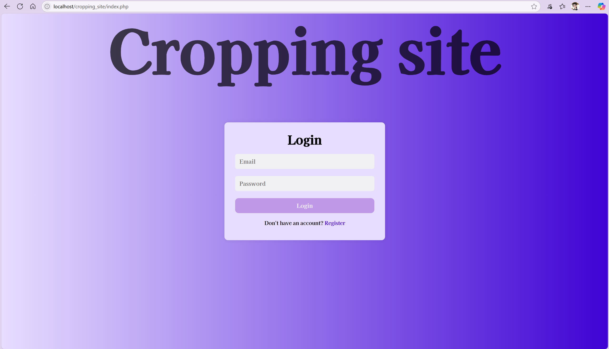
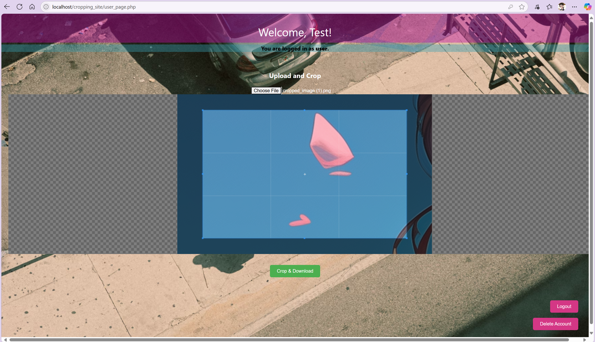
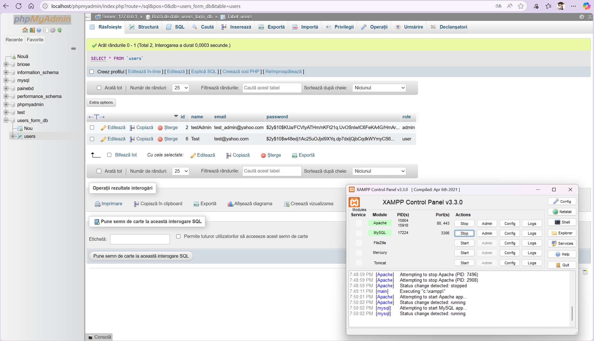

<h1>EN-Image Cropping Website with Login/Register and Admin/User Roles</h1>

<h2>Description</h2>

This project is a simple image cropping website inspired by the 
  <a href="https://www.youtube.com/watch?v=LiomRvK7AM8" target="_blank" rel="noopener noreferrer">
    video tutorial
  </a>.

<h2>Main features:</h2>
<ul>
  <li>User registration and authentication (roles <code>admin</code> and <code>user</code>)</li>
  <li>Users stored in a MySQL database (phpMyAdmin, XAMPP)</li>
  <li>Users with <code>user</code> role can upload images and crop them</li>
  <li>Admin can manage users, including deleting created accounts</li>
</ul>

<h2>Project structure</h2>
<ul>
  <li><code>config.php</code> - MySQL database connection (localhost/XAMPP)</li>
  <li><code>index.php</code> - Login and registration page with toggle between forms</li>
  <li><code>login_register.php</code> - Authentication and registration logic, validations, and redirects</li>
  <li><code>admin_page.php</code> - Admin page: display user list and option to delete accounts (except own)</li>
  <li><code>user_page.php</code> - User page: image upload, cropping using Cropper.js, and option to delete own account</li>
  <li><code>logout.php</code> - Logout and session destruction</li>
  <li><code>style.css</code> - General styling of forms</li>
  <li><code>script.js</code> - JavaScript to toggle between login and register forms</li>
  <li><code>Cropper.js</code> - JS library included via CDN for cropping functionality</li>
</ul>

<h2>Main functionalities</h2>

<h3>Register / Login</h3>
<ul>
  <li>Registration allows choosing the role <code>user</code> or <code>admin</code></li>
  <li>On login, the user is redirected to the appropriate page based on role:
    <ul>
      <li><code>admin_page.php</code> for admins</li>
      <li><code>user_page.php</code> for regular users</li>
    </ul>
  </li>
</ul>

<h3>Admin Page</h3>
<ul>
  <li>Displays a list of all users (name, email, role)</li>
  <li>Allows admin to delete any user except their own account</li>
</ul>

<h3>User Page</h3>
<ul>
  <li>Allows uploading an image from the device</li>
  <li>Cropper.js enables cropping the image in-browser with local download of the result</li>
  <li>Option to delete own account</li>
</ul>

<h2>Database</h2>

Assumes a MySQL database named <code>users_form_db</code>, with a <code>users</code> table containing the following columns:

<table border="1" cellpadding="8" cellspacing="0" style="border-collapse: collapse; width: 100%; max-width: 700px;">
  <thead style="background-color: #3F02D4; color: white;">
    <tr>
      <th>Column</th>
      <th>Type</th>
      <th>Description</th>
      <th>Constraints</th>
    </tr>
  </thead>
  <tbody>
    <tr>
      <td><code>id</code></td>
      <td>INT</td>
      <td>Unique identifier</td>
      <td>PRIMARY KEY, AUTO_INCREMENT</td>
    </tr>
    <tr>
      <td><code>name</code></td>
      <td>VARCHAR(255)</td>
      <td>User's name</td>
      <td>NOT NULL</td>
    </tr>
    <tr>
      <td><code>email</code></td>
      <td>VARCHAR(255)</td>
      <td>Email address</td>
      <td>NOT NULL, UNIQUE</td>
    </tr>
    <tr>
      <td><code>password</code></td>
      <td>VARCHAR(255)</td>
      <td>Hashed password</td>
      <td>NOT NULL</td>
    </tr>
    <tr>
      <td><code>role</code></td>
      <td>ENUM('admin', 'user')</td>
      <td>User role</td>
      <td>NOT NULL</td>
    </tr>
  </tbody>
</table>

<h2>Installation & Local Setup</h2>
<ol>
  <li>Install <a href="https://www.apachefriends.org/index.html" target="_blank" rel="noopener noreferrer">XAMPP</a> and start Apache and MySQL.</li>
  <li>Import the <code>users_form_db</code> database in phpMyAdmin (or manually create the <code>users</code> table).</li>
  <li>Place the project files inside the <code>htdocs</code> folder in XAMPP.</li>
  <li>Modify the credentials in <code>config.php</code> if necessary (MySQL user, password).</li>
  <li>Open your browser and navigate to <code>http://localhost/index.php</code>.</li>
  <li>Register an <code>admin</code> and a <code>user</code> account for testing.</li>
</ol>

<h2>Technologies used</h2>
<ul>
  <li>PHP</li>
  <li>MySQL / MariaDB (phpMyAdmin)</li>
  <li>HTML, CSS, JavaScript</li>
  <li>Cropper.js</li>
  <li>XAMPP (Apache + MySQL) for local server</li>
</ul>

<h2>Notes</h2>
<ul>
  <li>Passwords are hashed using PHP's <code>password_hash</code> function.</li>
  <li>Basic session protection without advanced security implementations.</li>
  <li>Simple system intended for demos or small projects.</li>
  <li>Cropping is done entirely client-side (in the browser); images are not saved on the server.</li>
</ul>

<h2>Screenshots</h2>
  

  

  

  

  

  

 

  

  

  <h1>RO-Site de Cropping Imagine cu Login/Register și Roluri Admin/User</h1>

  <h2>Descriere</h2>
  
Acest proiect este un site web simplu de cropping imagini, inspirat de 
    <a href="https://www.youtube.com/watch?v=LiomRvK7AM8" target="_blank" rel="noopener noreferrer">
      tutorialul video 
    </a>.
    <h2>Are funcționalități complete de:</h2>
  <ul>
    <li>Înregistrare și autentificare utilizatori (roluri <code>admin</code> și <code>user</code>)</li>
    <li>Stocarea utilizatorilor într-o bază de date MySQL (phpMyAdmin, XAMPP)</li>
    <li>Utilizatorii cu rol <code>user</code> pot încărca imagini și le pot decupa (cropp)</li>
    <li>Adminul poate gestiona utilizatorii, inclusiv ștergerea conturilor create</li>
  </ul>

  <h2>Structura proiectului</h2>
  <ul>
    <li><code>config.php</code> - Conexiunea la baza de date MySQL (localhost/XAMPP)</li>
    <li><code>index.php</code> - Pagina de login și înregistrare cu switch între formulare</li>
    <li><code>login_register.php</code> - Logica de autentificare și înregistrare, verificări și redirectări</li>
    <li><code>admin_page.php</code> - Pagina pentru admin: afișare listă utilizatori și opțiune de ștergere conturi (în afară de cel propriu)</li>
    <li><code>user_page.php</code> - Pagina pentru utilizatori: încărcare imagine, cropping folosind Cropper.js și ștergere cont propriu</li>
    <li><code>logout.php</code> - Logout și distrugerea sesiunii</li>
    <li><code>style.css</code> - Stilizarea generală a formularelor</li>
    <li><code>script.js</code> - JavaScript pentru toggle între formularele login și register</li>
    <li><code>Cropper.js</code> - Biblioteca JS inclusă din CDN pentru funcția de crop</li>
  </ul>

  <h2>Funcționalități principale</h2>
  <h3>Înregistrare / Login</h3>
  <ul>
    <li>Înregistrarea permite alegerea rolului <code>user</code> sau <code>admin</code></li>
    <li>La login, utilizatorul este redirecționat către pagina potrivită rolului:
      <ul>
        <li><code>admin_page.php</code> pentru admini</li>
        <li><code>user_page.php</code> pentru utilizatori normali</li>
      </ul>
    </li>
  </ul>

  <h3>Pagina Admin</h3>
  <ul>
    <li>Afișează o listă cu toți utilizatorii (nume, email, rol)</li>
    <li>Permite adminului să șteargă orice utilizator, cu excepția contului propriu</li>
  </ul>

  <h3>Pagina User</h3>
  <ul>
    <li>Permite încărcarea unei imagini de pe device</li>
    <li>Cropper.js permite decuparea imaginii în browser, cu descărcare locală a rezultatului</li>
    <li>Opțiune de ștergere a contului propriu</li>
  </ul>

<h2>Baza de date</h2>

Se presupune o bază de date MySQL numită <code>users_form_db</code>, cu un tabel <code>users</code> având următoarele coloane:

<table border="1" cellpadding="8" cellspacing="0" style="border-collapse: collapse; width: 100%; max-width: 700px;">
  <thead style="background-color: #3F02D4; color: white;">
    <tr>
      <th>Coloană</th>
      <th>Tip</th>
      <th>Descriere</th>
      <th>Constrângeri</th>
    </tr>
  </thead>
  <tbody>
    <tr>
      <td><code>id</code></td>
      <td>INT</td>
      <td>Identificator unic</td>
      <td>PRIMARY KEY, AUTO_INCREMENT</td>
    </tr>
    <tr>
      <td><code>name</code></td>
      <td>VARCHAR(255)</td>
      <td>Numele utilizatorului</td>
      <td>NOT NULL</td>
    </tr>
    <tr>
      <td><code>email</code></td>
      <td>VARCHAR(255)</td>
      <td>Adresa de email</td>
      <td>NOT NULL, UNIQUE</td>
    </tr>
    <tr>
      <td><code>password</code></td>
      <td>VARCHAR(255)</td>
      <td>Parola criptată</td>
      <td>NOT NULL</td>
    </tr>
    <tr>
      <td><code>role</code></td>
      <td>ENUM('admin', 'user')</td>
      <td>Rolul utilizatorului</td>
      <td>NOT NULL</td>
    </tr>
  </tbody>
</table>

  <h2>Instalare & rulare locală</h2>
  <ol>
    <li>Instalează <a href="https://www.apachefriends.org/index.html" target="_blank" rel="noopener noreferrer">XAMPP</a> și pornește Apache și MySQL.</li>
    <li>Importă baza de date <code>users_form_db</code> în phpMyAdmin (sau creează manual tabelul <code>users</code>).</li>
    <li>Plasează fișierele proiectului în folderul <code>htdocs</code> din XAMPP.</li>
    <li>Modifică datele din <code>config.php</code> dacă este nevoie (user, parolă MySQL).</li>
    <li>Accesează în browser <code>http://localhost/index.php</code>.</li>
    <li>Înregistrează un cont <code>admin</code> și unul <code>user</code> pentru testare.</li>
  </ol>

  <h2>Tehnologii folosite</h2>
  <ul>
    <li>PHP </li>
    <li>MySQL / MariaDB (phpMyAdmin)</li>
    <li>HTML, CSS, JavaScript</li>
    <li>Cropper.js </li>
    <li>XAMPP (Apache + MySQL) pentru server local</li>
  </ul>

  <h2>Observații</h2>
  <ul>
    <li>Parolele sunt criptate cu <code>password_hash</code> PHP.</li>
    <li>Protecție minimă prin sesiuni, fără implementări avansate de securitate.</li>
    <li>Sistem simplu pentru demo sau proiecte mici.</li>
    <li>Cropping se face doar în client (browser), imaginea nu se salvează pe server.</li>
  </ul>

</body>
</html>
